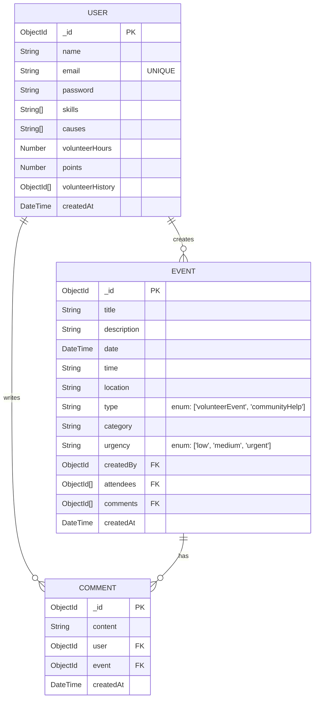

# HandsOn - Volunteer Platform

## 🌟 Project Overview
A GitHub-like platform for social volunteering that connects individuals with meaningful community impact opportunities through organized events and team initiatives.

## 🛠 Tech Stack
**Frontend**:
- React
- Tailwind CSS 3
- Axios

**Backend**:
- Node.js
- Express
- MongoDB (with Mongoose)
- JWT Authentication

## 🚀 Key Features
- User registration & profile management
- Event discovery with advanced filters
- One-click event registration
- Create events and community helps
- Comments on events and community helps

## Database Schema 🗃️



## Backend Setup:
cd backend
npm install

## Frontend Setup
cd frontend
npm install

## Start Development Servers
#Backend (from server directory):
npm run dev

#Frontend (from client directory):
npm run dev

# API Authentication Documentation

## API Endpoints

### Authentication
| Method | Endpoint | Description | Auth Required |
|--------|----------|-------------|-------------|
| `POST` | `/api/auth/register` | Register a new user | ❌ |
| `POST` | `/api/auth/login` | Login a user | ❌ |
| `POST` | `/api/auth/logout` | Logout a user | ✅ |

#### Example User for Testing
```json
{
    "name": "Jamiul Islam",
    "email": "jamil@email.com",
    "password": "Jamil123"
}
```

### Events
| Method | Endpoint | Description | Auth Required |
|--------|----------|-------------|-------------|
| `POST` | `/api/events` | Create a new event | ✅ 
| `GET` | `/api/events` | Get all events | ❌ |
| `GET` | `/api/events/:eventId` | Get a single event by ID | ❌ |
| `POST` | `/api/events/:id/join` | Join an event | ✅ 
| `GET` | `/api/events/user/:userId` | Get events by user ID | ✅ 

### Comments
| Method | Endpoint | Description | Auth Required |
|--------|----------|-------------|---------------|
| `POST` | `/api/events/:eventId/comments` | Add a comment to an event | ✅             |
| `GET` | `/api/events/:eventId/comments` | Get comments for an event | ❌             |

### User Profile
| Method | Endpoint | Description | Auth Required |
|--------|----------|-------------|-------------|
| `GET` | `/api/users/profile` | Get user profile | ✅ |
| `PUT` | `/api/users/profile` | Update user profile | ✅ |